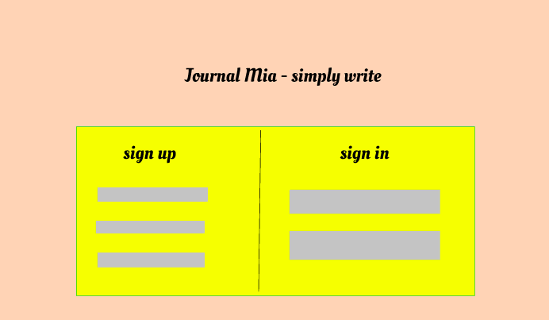
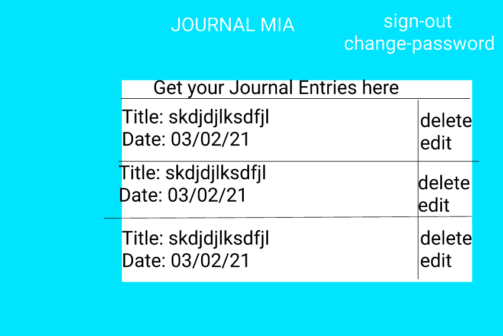

## Journal Mia - A Music Journal

## Links
- [Deployed Client] (https://kechib.github.io/journal-client/)
- [API Repo] (https://github.com/kechib/journal-api)
- [Deployed API] (https://journalmia.herokuapp.com/)

## Description:
Journal Mia is a music journal web application that allows users to create an account and make Journal Entries with a content description of their choice. Users can add embed Apple Music songs to describe their feelings at the moment of their entry. Users will be able to see and reflect on their entries by date. This project was created with React as the main front-end framework.

## Planning Story
For this project I spent most of my time re-learning react concepts, reviewing previous lessons, notes, and getting each route to work successfully.  Then I implemented the music library feature, I wanted the library to be able to sign you in to apple music and play your picked embedded song in the Show App page. This was the hardest and most challenging feature. Once successfully getting the music library to play music, I styled the application.

## Preparation

1. Fork and clone this repository.
2. Create a new branch, `example`, for your work.
3. Checkout to the `example` branch.
4. Install dependencies with `npm install`.
5. Start up client with `npm run start`.

## User Stories
- As a user I want to: Sign Up
- As a user I want to: Sign In
- As a user I want to: Change my password
- As a user I want to: Sign Out
- As a user I want to: make a journal entry
-	As a user I want to: view a single journal entry
-	As a user I want to: view all my journal entries
-	As a user I want to: edit an entry I created
-	As a user I want to: delete an entry I created
- As a user I want to: find a song from Apple Music to embed
- As a user I want to: play my song

## Technologies Used
- React
- NodeJS
- Axios
- HTML
- SCSS
- React-Bootstrap
- Bootstrap
- NPM
- JSX
- Javascript

## User Stories

